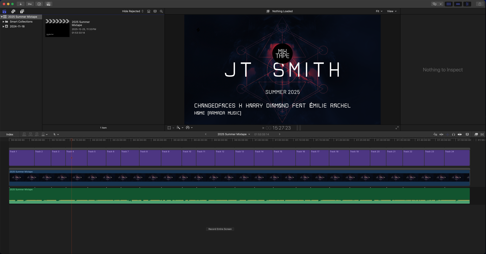

# DJ Mix Generator

A set of Python scripts to convert an Ableton mix to a YouTube-compatible video

## Features

- **Ableton tracklist generator** (`generate_tracklist.py`): Reads the list of
  audio files from your Ableton project and creates a text file with track
  information
- **FCPXML Generator** (`fcpxml_generator.py`): Creates Final Cut Pro XML files
  with automatic track title overlays, transitions, and fade effects for
  professional-looking mixtape videos.
- **YouTube Chapters Generator** (`youtube_chapters.py`): Converts tracklists
  into YouTube-compatible chapter timestamps for video descriptions.

## Requirements

- macOS
- Ableton (tested on v12+)
- Final Cut Pro
- Python 3.6+
- FFProbe (for audio duration detection in FCPXML generator)
  - Install via Homebrew: `brew install ffmpeg`
  - Or download from: https://ffmpeg.org/download.html

## Installation

1. Clone or download this repository
2. Ensure Python 3.6+ is installed
3. Install FFmpeg for audio file processing

## Tracklist Format

The FCP and YouTube scripts expect a tracklist file with the following format:

```
1. Artist Name - Track Title - HH:MM:SS
2. Another Artist - Another Track - HH:MM:SS
3. Third Artist - Third Track - HH:MM:SS
```

**Important Notes:**

- The tracklist generator will not add timestamps and so you will need to add
  them manually before using the other scripts
- Each track must start on a new line
- Format must be: `Track Number. Artist - Track Title - HH:MM:SS`
- Timestamps should be in 24-hour format (HH:MM:SS)
- The first track should start at 00:00:00

## Usage

### Tracklist Generator

**NOTE:** It is assumed that the audio files used in your Ableton project are
named like: `CAMELOT - BPM - Trackname` If this is not the case, you will
need to modify the regex labelled 'file_name' in `generate_tracklist.py`
to match your naming scheme.

1. Make a copy of your Ableton project
2. Run the script to generate a tracklist:
   `python3 generate_tracklist.py <project_file>`
   For example:
   `python3 generate_tracklist.py '2025 Winter Mixtape.als'`
3. The tracklist will be saved in the current folder as `tracklist.txt` however,
   this file will still need manual attention. The file will _not_ contain
   timestamps so these must be added manually for the other scripts to work.

### FCPXML Generator

Generates a Final Cut Pro XML file with track titles overlaid on a background image.

```bash
python3 fcpxml_generator.py <tracklist_file> <mixtape_name> <background_image> <audio_file>
```

**Parameters:**

- `tracklist_file`: Path to your tracklist text file
- `mixtape_name`: Name of your mixtape (used for project naming)
- `background_image`: Path to background image file (PNG/JPG recommended)
- `audio_file`: Path to the audio file (used to determine video duration)

**Example:**

```bash
python3 fcpxml_generator.py Tracklist.txt "Summer 2025 Mixtape" background.png mix.aif
```

**What it creates:**

- Generates a `.fcpxml` file that can be double-clicked to open in Final Cut Pro
- Creates a video sequence with your background image and audio
- Adds animated track title overlays that appear at each timestamp
- Includes fade-out effects and transitions for the final track

#### Instructions

1. Double-click the generated `.fcpxml` file to open in Final Cut Pro
2. Choose an existing bundle to import into or create a new one
3. Once in the main FCP window, select the bundle you imported to, and then
   double click the resource you just made. This should open the video sequence
   you just created onto the timeline.
4. Edit the video sequence as needed, such as adding any other transitions and
   fade effects
5. Export the video sequence to your preferred format and share it with your audience

If everything was imported correctly, you should see something similar to this:



### YouTube Chapters Generator

Generates YouTube-compatible chapter timestamps from your tracklist.

```bash
python3 youtube_chapters.py <tracklist_file> [--with-numbers]
```

**Parameters:**

- `tracklist_file`: Path to your tracklist text file
- `--with-numbers` (optional): Include track numbers in chapter names

**Examples:**

```bash
python3 youtube_chapters.py Tracklist.txt
python3 youtube_chapters.py Tracklist.txt --with-numbers
```

**Output:**

- Displays chapters on screen for easy copying
- Saves chapters to `youtube_chapters.txt`
- Ready to paste into YouTube video descriptions

## Example Tracklist

Create a file called `Tracklist.txt` with content like:

```
1. Daft Punk - Harder Better Faster Stronger - 00:00:00
2. The Chemical Brothers - Hey Boy Hey Girl - 00:05:36
3. Fatboy Slim - Praise You - 00:11:12
```

## Tips

- **FCPXML Generator:**
  - Use high-resolution background images (1920x1080 or higher recommended)
  - Supported image formats: PNG, JPG, TIFF
  - Audio file duration determines the final video length
  - Double-check the imported media paths in Final Cut Pro after opening the XML

- **YouTube Chapters:**
  - Copy the generated chapters directly into your YouTube video description
  - Chapters appear in the video player when properly formatted
  - Maximum 100 chapters per video

## Todo List

Below are a list of features I would like to be added in the future. These are
also good ideas for pull requests, if you would like to help out.

- Add support for animated background images

## Contributing

All contributions are welcome!

- Fork this repository
- Create a branch for your changes
- Make your changes
- Commit and push your changes
- Submit a pull request

## Troubleshooting

- **FCPXML Generator:**
  - Ensure FFProbe is installed and accessible via command line
  - Verify all file paths exist before running
  - Check that your tracklist follows the exact format required

- **YouTube Chapters:**
  - Ensure timestamps are in chronological order
  - YouTube requires chapters to be at least 10 seconds apart for mobile devices

## License

This project is open source. Feel free to use and modify as needed.
